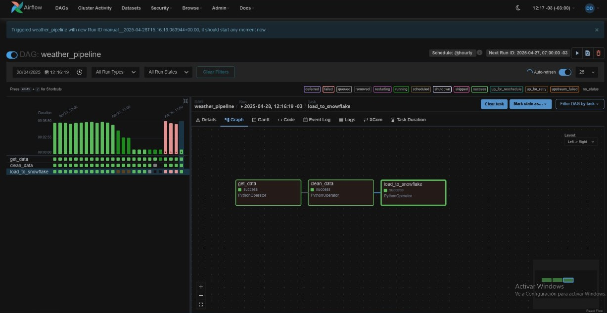
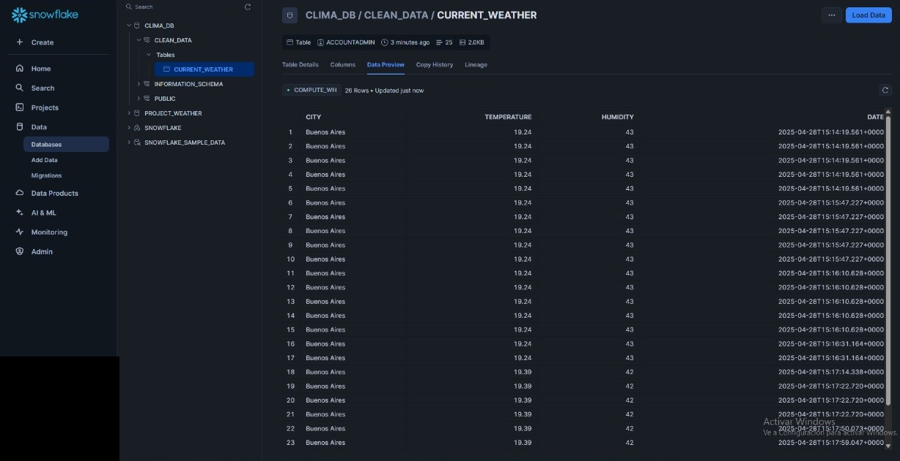

## **English**

---
This project implements a pipeline for 
extracting, cleaning, and storing meteorological data. It uses Apache Airflow for orchestration, Pandas for data cleansing, and Snowflake for data cleansing.

# How It Works ⚙️
---
This project uses an Apache Airflow DAG called weather_dag.py, which is divided into three main tasks:

1. Data extraction: Connects to the OpenWeatherMap API to retrieve current weather data.

2. Data cleaning: Processes and cleans the retrieved data using Pandas.

3. Data loading: Saves the cleaned data to a CSV file and uploads it into a Snowflake table.
---
# Screenshots 🖼️

## Airflow process visualization

## Data visualization in Snowflake

## **ESPAÑOL**

---
Este proyecto implementa un pipeline para la extracción, limpieza y almacenamiento de datos meteorológicos. Utiliza Apache Airflow para la orquestación, Pandas para la limpieza de datos y Snowflake como base de datos para almacenar los datos procesados.db 

# Cómo Funciona ⚙️
--- 
Este proyecto utiliza un DAG de Apache Airflow llamado weather_dag.py, el cual está compuesto por tres tareas principales:

1. Extracción de datos: Se conecta a la API de OpenWeatherMap para obtener datos meteorológicos actuales.

2. Limpieza de datos: Utiliza Pandas para procesar y limpiar la información obtenida.

3. Carga de datos: Guarda los datos limpios en formato CSV y los carga en una tabla de Snowflake.
---
# Capturas 🖼️

## Visualización del flujo en Airflow

## Visualización de los datos en Snowflake

